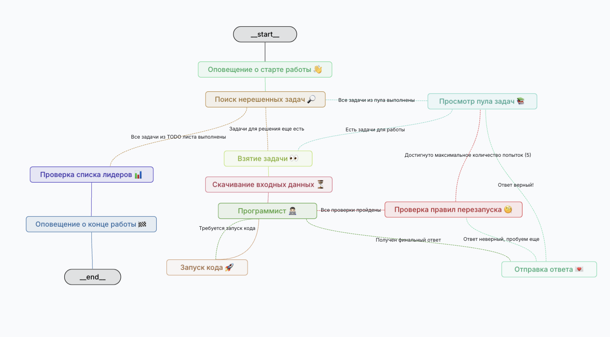

# Copilot for Advent of Code with LLM

Этот проект представляет собой вашего личного помощника для решения задач с сайта [Advent of Code](https://adventofcode.com), использующего мощь больших языковых моделей (LLM)



## Описание

Advent of Code - это ежегодное событие, предлагающее ежедневные задачи по программированию в декабре. Этот проект разработан для того, чтобы помочь вам решать эти задачи с минимальными усилиями. С нашим "копилотом" вам не придется вставать с рассветом, чтобы не отставать от быстрее решающих участников в таблице лидеров.

## Особенности проекта

- **Автоматическое решение задач**: LLM берет на себя работу и предоставляет вам решения без необходимости углубляться в детали.
  
- **Интеграция с LangChain и LangGraph**: Использование этих библиотек позволяет создавать сложные цепочки обработки и визуализировать потоки данных.

## Запуск

Необходимо запустить сервер langgraph:
 ```bash
 langgraph up
 ```

Все будет доступно по ссылкам:
- API: http://localhost:8123
- Docs: http://localhost:8123/docs
- LangGraph Studio: https://smith.langchain.com/studio/?baseUrl=http://127.0.0.1:8123